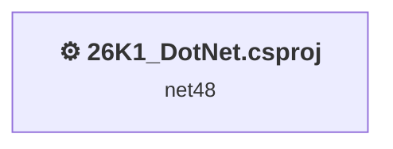
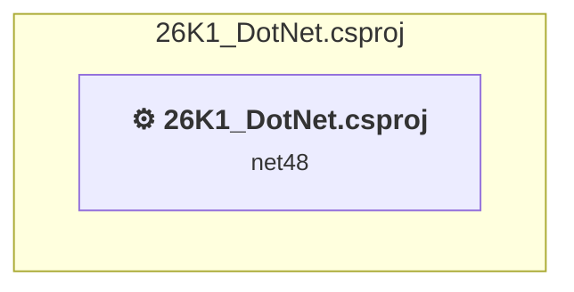

# Projects and dependencies analysis

This document provides a comprehensive overview of the projects and their dependencies in the context of upgrading to .NETCoreApp,Version=v8.0.

## Table of Contents

- [Executive Summary](#executive-Summary)
  - [Highlevel Metrics](#highlevel-metrics)
  - [Projects Compatibility](#projects-compatibility)
  - [Package Compatibility](#package-compatibility)
  - [API Compatibility](#api-compatibility)
  - [Binding Redirect Configuration](#binding-redirect-configuration)
- [Aggregate NuGet packages details](#aggregate-nuget-packages-details)
- [Top API Migration Challenges](#top-api-migration-challenges)
  - [Technologies and Features](#technologies-and-features)
  - [Most Frequent API Issues](#most-frequent-api-issues)
- [Projects Relationship Graph](#projects-relationship-graph)
- [Project Details](#project-details)

  - [26K1_DotNet\26K1_DotNet.csproj](#26k1_dotnet26k1_dotnetcsproj)

## Executive Summary

### Highlevel Metrics

| Metric | Count | Status |
| :--- | :---: | :--- |
| Total Projects | 1 | All require upgrade |
| Total NuGet Packages | 0 | All compatible |
| Total Code Files | 6 |  |
| Total Code Files with Incidents | 5 |  |
| Total Lines of Code | 216 |  |
| Total Number of Issues | 21 |  |
| Estimated LOC to modify | 19+ | at least 8.8% of codebase |

### Projects Compatibility

| Project | Target Framework | Difficulty | Package Issues | API Issues | Binding Issues | Est. LOC Impact | Description |
| :--- | :---: | :---: | :---: | :---: | :---: | :---: | :--- |
| [26K1_DotNet\26K1_DotNet.csproj](#26k1_dotnet26k1_dotnetcsproj) | net48 | 🟢 Low | 0 | 19 | 0 | 19+ | ClassicWinForms, Sdk Style = False |

### Package Compatibility

| Status | Count | Percentage |
| :--- | :---: | :---: |
| ✅ Compatible | 0 | 0.0% |
| ⚠️ Incompatible | 0 | 0.0% |
| 🔄 Upgrade Recommended | 0 | 0.0% |
| ***Total NuGet Packages*** | ***0*** | ***100%*** |

### API Compatibility

| Category | Count | Impact |
| :--- | :---: | :--- |
| 🔴 Binary Incompatible | 17 | High - Require code changes |
| 🟡 Source Incompatible | 2 | Medium - Needs re-compilation and potential conflicting API error fixing |
| 🔵 Behavioral change | 0 | Low - Behavioral changes that may require testing at runtime |
| ✅ Compatible | 51 |  |
| ***Total APIs Analyzed*** | ***70*** |  |

## Aggregate NuGet packages details

| Package | Current Version | Suggested Version | Projects | Description |
| :--- | :---: | :---: | :--- | :--- |

## Top API Migration Challenges

### Technologies and Features

| Technology | Issues | Percentage | Migration Path |
| :--- | :---: | :---: | :--- |
| Windows Forms | 17 | 89.5% | Windows Forms APIs for building Windows desktop applications with traditional Forms-based UI that are available in .NET on Windows. Enable Windows Desktop support: Option 1 (Recommended): Target net9.0-windows; Option 2: Add <UseWindowsDesktop>true</UseWindowsDesktop>; Option 3 (Legacy): Use Microsoft.NET.Sdk.WindowsDesktop SDK. |
| Legacy Configuration System | 2 | 10.5% | Legacy XML-based configuration system (app.config/web.config) that has been replaced by a more flexible configuration model in .NET Core. The old system was rigid and XML-based. Migrate to Microsoft.Extensions.Configuration with JSON/environment variables; use System.Configuration.ConfigurationManager NuGet package as interim bridge if needed. |

### Most Frequent API Issues

| API | Count | Percentage | Category |
| :--- | :---: | :---: | :--- |
| T:System.Windows.Forms.Application | 3 | 15.8% | Binary Incompatible |
| T:System.Windows.Forms.AutoScaleMode | 3 | 15.8% | Binary Incompatible |
| M:System.Windows.Forms.Form.#ctor | 2 | 10.5% | Binary Incompatible |
| M:System.Configuration.ApplicationSettingsBase.#ctor | 1 | 5.3% | Source Incompatible |
| T:System.Configuration.ApplicationSettingsBase | 1 | 5.3% | Source Incompatible |
| M:System.Windows.Forms.Application.Run(System.Windows.Forms.Form) | 1 | 5.3% | Binary Incompatible |
| M:System.Windows.Forms.Application.SetCompatibleTextRenderingDefault(System.Boolean) | 1 | 5.3% | Binary Incompatible |
| M:System.Windows.Forms.Application.EnableVisualStyles | 1 | 5.3% | Binary Incompatible |
| P:System.Windows.Forms.Form.Text | 1 | 5.3% | Binary Incompatible |
| P:System.Windows.Forms.Form.ClientSize | 1 | 5.3% | Binary Incompatible |
| F:System.Windows.Forms.AutoScaleMode.Font | 1 | 5.3% | Binary Incompatible |
| P:System.Windows.Forms.ContainerControl.AutoScaleMode | 1 | 5.3% | Binary Incompatible |
| M:System.Windows.Forms.Form.Dispose(System.Boolean) | 1 | 5.3% | Binary Incompatible |
| T:System.Windows.Forms.Form | 1 | 5.3% | Binary Incompatible |

## Projects Relationship Graph

Legend:
📦 SDK-style project
⚙️ Classic project

## Project Details

### 26K1_DotNet\26K1_DotNet.csproj

#### Project Info

- **Current Target Framework:** net48
- **Proposed Target Framework:** net8.0-windows
- **SDK-style**: False
- **Project Kind:** ClassicWinForms
- **Dependencies**: 0
- **Dependants**: 0
- **Number of Files**: 7
- **Number of Files with Incidents**: 5
- **Lines of Code**: 216
- **Estimated LOC to modify**: 19+ (at least 8.8% of the project)

#### Dependency Graph

Legend:
📦 SDK-style project
⚙️ Classic project

### API Compatibility

| Category | Count | Impact |
| :--- | :---: | :--- |
| 🔴 Binary Incompatible | 17 | High - Require code changes |
| 🟡 Source Incompatible | 2 | Medium - Needs re-compilation and potential conflicting API error fixing |
| 🔵 Behavioral change | 0 | Low - Behavioral changes that may require testing at runtime |
| ✅ Compatible | 51 |  |
| ***Total APIs Analyzed*** | ***70*** |  |

#### Project Technologies and Features

| Technology | Issues | Percentage | Migration Path |
| :--- | :---: | :---: | :--- |
| Legacy Configuration System | 2 | 10.5% | Legacy XML-based configuration system (app.config/web.config) that has been replaced by a more flexible configuration model in .NET Core. The old system was rigid and XML-based. Migrate to Microsoft.Extensions.Configuration with JSON/environment variables; use System.Configuration.ConfigurationManager NuGet package as interim bridge if needed. |
| Windows Forms | 17 | 89.5% | Windows Forms APIs for building Windows desktop applications with traditional Forms-based UI that are available in .NET on Windows. Enable Windows Desktop support: Option 1 (Recommended): Target net9.0-windows; Option 2: Add <UseWindowsDesktop>true</UseWindowsDesktop>; Option 3 (Legacy): Use Microsoft.NET.Sdk.WindowsDesktop SDK. |

